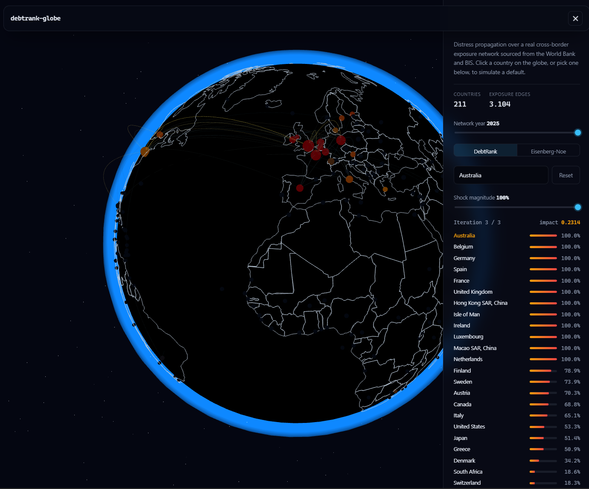

# debtrank-globe

An interactive, model-driven visualization of sovereign external debt contagion risk.

**Live application:** [lastch1ld.github.io/debtrank-globe](https://lastch1ld.github.io/debtrank-globe/)

Instead of just charting external debt statistics (à la [JEDH](https://www.jedh.org/)), this
project builds a real cross-border debt exposure network from public World Bank and BIS data,
then runs published financial systemic-risk algorithms on it:

- **DebtRank** (Battiston, Puliga, Kaushik, Tasca & Caldarelli, 2012) — iterative distress
  propagation through a weighted exposure network, used by central banks for systemic risk
  assessment.
- **Eisenberg–Noe clearing model** (Eisenberg & Noe, 2001) — fixed-point clearing vector for
  network default cascades, used as a secondary/comparison model.

The result: pick a country, dial in a shock magnitude, toggle between DebtRank and
Eisenberg-Noe, and watch distress propagate through the real global debt network on an
interactive 3D globe — for any year from 2005 to 2025 via the year scrubber.

## Structure

- [`data-pipeline/`](data-pipeline) — fetches and normalizes World Bank (external debt, reserves,
  GDP) and BIS (bilateral cross-border banking exposures) data into a network snapshot.
- [`model/`](model) — Python implementation of DebtRank and Eisenberg–Noe, with correctness
  tests reproducing the toy examples from the original papers.
- [`web/`](web) — React Three Fiber static site: 3D globe visualization and interactive shock
  simulation.

## Data attribution

- External debt, reserves, and GDP indicators: [World Bank Indicators API](https://api.worldbank.org/v2/),
  International Debt Statistics database.
- Cross-border bilateral banking exposures: [BIS Locational Banking Statistics](https://data.bis.org/),
  used under the BIS's terms of permitted use. Only a small, derived, aggregated network
  snapshot is redistributed in this repo — not bulk BIS data.

## Status

Functional end-to-end: real data pipeline, correctness-tested DebtRank and Eisenberg-Noe
models (Python reference + matching TypeScript ports), and an interactive globe with a
model toggle, shock-magnitude control, and a 2005–2025 historical year scrubber. Not yet
deployed as a static site (see `web/README.md` for running it locally).

## License

MIT — see [LICENSE](LICENSE).
